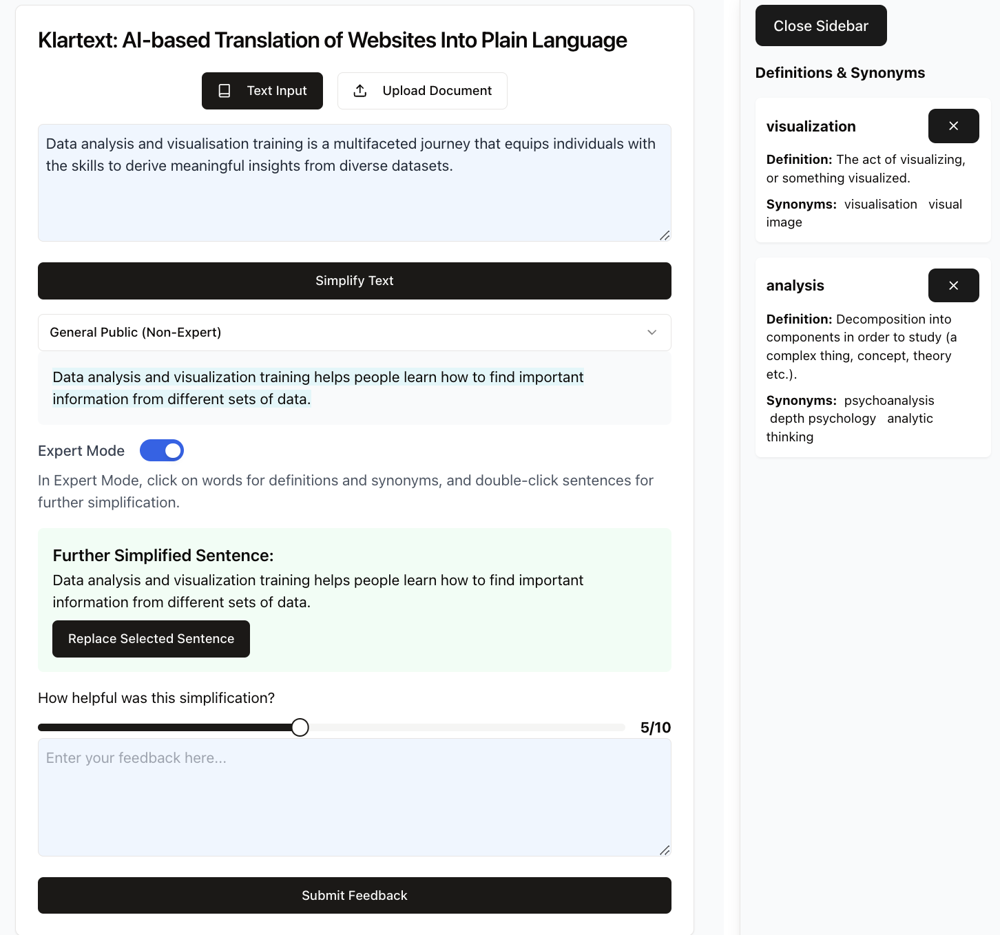
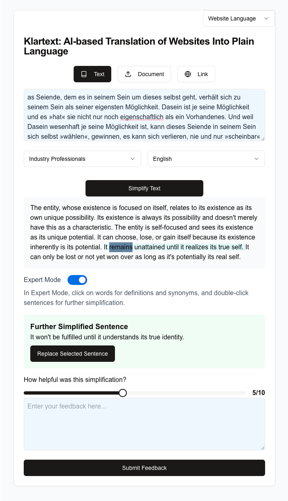

# Klartext: AI-based Translation of Websites Into Plain Language

[](https://github.com/grussdorian/klartext/actions/workflows/deploy.yml)

**Klartext** is an open-source project aimed at making complex information accessible by providing automatic text simplification for documents across various domains. This application allows users to input complex text and receive a simplified version suited to a target audience, promoting understanding and accessibility.

## Features

- *New: Chrome extension support in development*

- **Text Simplification**: Input complex text, or upload a PDF, to receive a simplified output designed for easier comprehension.
- **Targeted Audience Levels**: Customize text simplification to suit specific audience levels, ensuring that the output is aligned with the reader’s proficiency.
- **Expert Mode**: Toggle a mode that allows users to interact with words or sentences for further analysis and simplification.
- **Sentence Re-Simplification**: Select any sentence in the simplified text for additional simplification.
- **Sidebar Word Collection**: Selected words are added to the sidebar for easy access to their definitions and synonyms, preventing duplicates.

### **New features**

- **Output Language selection**: Change the output language independently from the input text's language

- **Website Language**: Change the language of the website.

- **Website simplification**: Paste in URL of a website and get simplification of the page

## Demo
You can checkout our demo at https://simplifymytext.org




---


A **tutorial video** is available at https://datashare.tu-dresden.de/s/XMqESdFefKxfJJ5

## Technologies Used

- **Frontend**: React with TypeScript.
- **Backend**: Express with TypeScript.
- **Styling**: Tailwind CSS.
- **APIs**: OpenAI (text simplification is done using `gpt-4`).

## Setup

### Prerequisites

- **Node.js** and **npm**.

### Installation

1. **Clone the Repository**
   ```bash
   git clone https://github.com/grussdorian/klartext.git
   cd klartext
   ```

2. **Install Dependencies**
   ```bash
   cd frontend
   npm install
   ```
    ```bash
   cd backend
   npm install
   ```

3. **Start the Application**
    ```bash
     npm run start
     ```

### Development

To run the application in development mode with hot-reloading:

```bash
npm run dev
```

## Usage

1. **Text Input**: Enter the text, or upload a PDF, to be simplified and select an audience level.
2. **Toggle Advanced Options** to enable features like word definitions and synonyms.
3. **Enable Expert Mode** to enable features like word definitions and synonyms by making words and sentences in the simplified text interactive.
4. **Sidebar for Word Collection**: to view word definitions and enable users to replace words in the simplified text with their synonyms.

## Contributing

We welcome contributions! Please submit issues for bugs or feature requests, and feel free to open pull requests to add new features or improve existing functionality.

## License

This project is licensed under the Apache License 2.0 - see the [LICENSE](./LICENSE) file for details.

